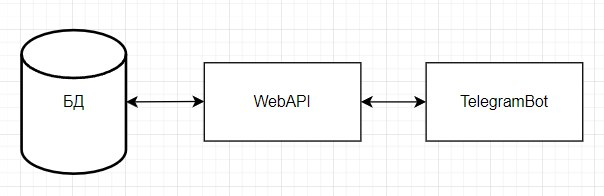
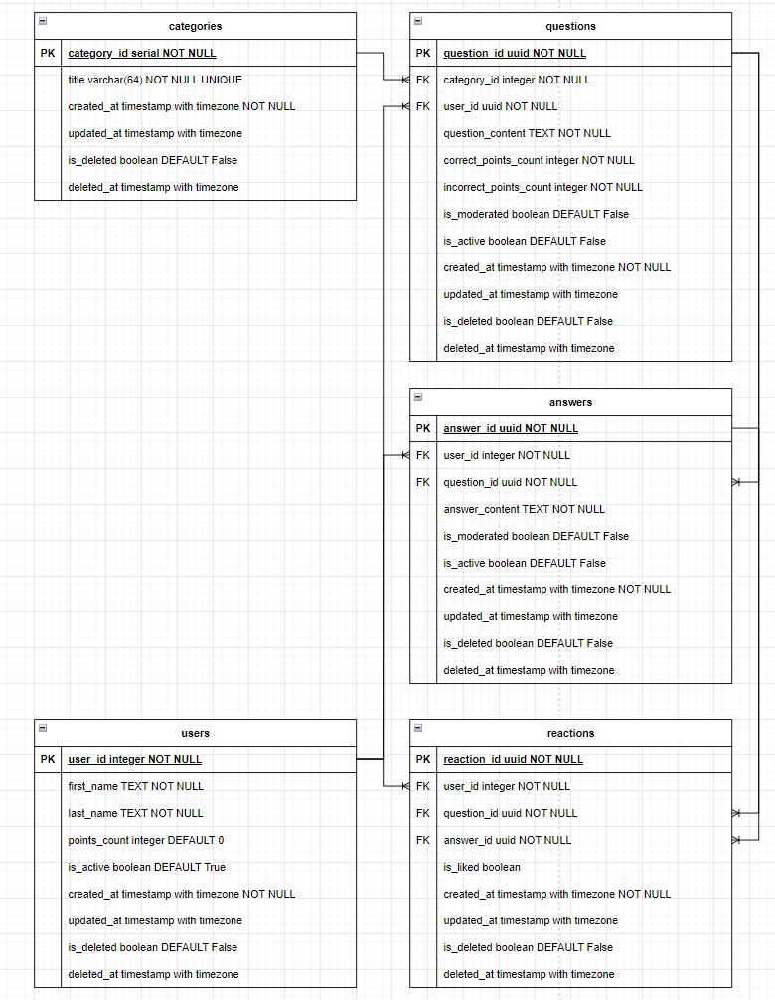
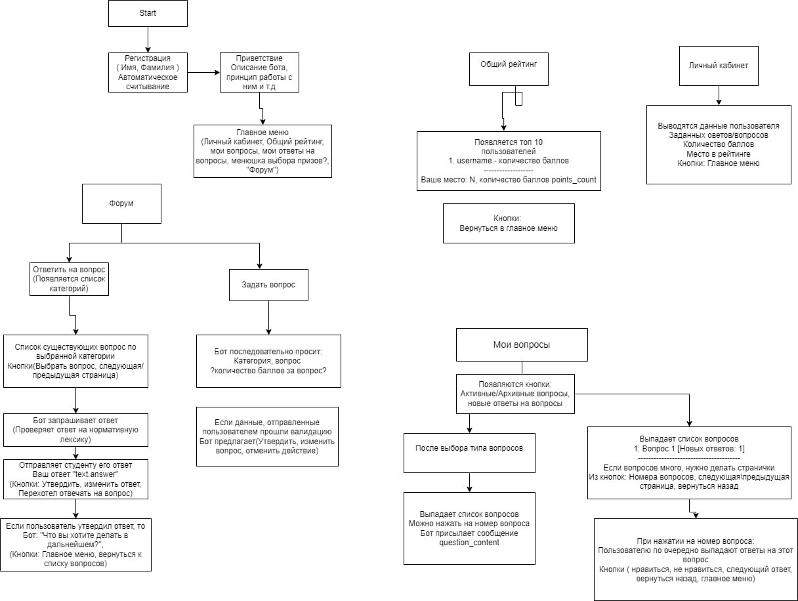

# HakatonBAGNET

## Схема работы приложения


## Используемые технологии

### База данных
В качестве СУБД используется PostgreSQL 16

#### Диаграмма Базы данных


### Бэкенд
Для реализации доступа к данным телеграм бот использует написанную Web API. При её разработке был использован фреймворк Asp .NET Core и .NET 8.0.

#### Установленные Библиотеки
* Swashbuckle.AspNetCore 6.4.0
* Microsoft.EntityFrameworkCore 8.0.8
* Microsoft.EntityFrameworkCore.Relational 8.0.8
* Npsql.EntityFrameworkCore.PostgreSQL 8.0.8
* Npsql 8.0.4


### Телеграм бот
При написание телеграм бота использовался язык python.

#### Алгоритм работы телеграмм бота


#### Установленные Библиотеки
* Aiogram3
* requests 
* asyncio
* json
* SQLAlchemy
* psycopg2

## Инструкция по запуску проекта

### Установка .NET 8.0
Для установки .NET нужной версии необходимо перейти на оффициальный сайт https://dotnet.microsoft.com/ru-ru/download/dotnet/8.0.

### Создание базы данных

#### Установка PostgreSQL Server
Для установки PostgreSQL сервера нужно перейти по ссылке https://www.postgresql.org/download/, выбрать для Windows и версию 16. Установить и запомнить пароль от пользователя postgres.

#### Установка dotnet entity framework tool
После успешной установки .NET, необходимо установить инструмент "dotnet entity framework tool" выполнив следующие шаги:
1. Открыть powershell;
2. Вставить команду "dotnet tool install --global dotnet-ef";
3. Нажать "Enter".

#### Настройка бэкенд проекта
Для того чтобы корректно создалась база данных, следует выполнить следующие инструкции:
1. Перейти в каталог /Backend/Src/HakatonBAGNET.Api/;
2. Найти файл appsettings.json;
3. Заменить в "ConnectionsStrings" пароль от пользователя postgres на тот что был установлен ранее.

#### Создание и применение миграции
Установив инструменты cоздания и применения миграции, необходимо выполнить следующие действия:
1. Перейти по папкам проекта /Backend/Src;
2. Открыть Powershell в этом пространстве;
3. Ввести команду "dotnet ef migrations add (название миграции) -s .\HakatonBAGNET.Api\ -p .\HakatonBAGNET.Domain\ ", тем самым создав миграцию; 
4. После создания миграции необходимо на ее основе создать базу данных при помощи команды "dotnet ef database update -s .\HakatonBAGNET.Api\ -p .\HakatonBAGNET.Domain\";
5. После успшного выполнения предыдущих шагов, можно перейти открыть приложение pgadmin для проверки корректного создания базы данных.

___


### Запуск бэкенд проекта
Для запуска бэкенд проекта, нужно сделать следующее:
1. Необходимо перейти по папкам /Backend/Src/HakatonBAGNET.Api;
2. Открыть в данном пространстве powershell;
3. Ввести команду "dotnet run";
4. Нажать "Enter", дождаться запуска проекта.

После выполнения выше перечисленных действий, можно открыть браузер, и перейдя по адресу http://localhost:8001/swagger, ознакомиться с эндпоинтами проекта...

___

### Запуск телеграм бота

#### Установка Python 3.11

На официальном сайте Python по ссылке https://www.python.org необходимо скачать и установить пакет Python 3.11

#### Установка виртуального окружения и запуск телеграмм бота

1. Создание виртуального окружения

```python3 -m venv venv```

2. Активация виртуального окружения

```source venv/bin/activate```

3. Установка зависимостей

```pip3 install -r requirements.txt```

4. Запуск скрипта для демонстрации возможностей Каишка Бот

```python3 body.py```


